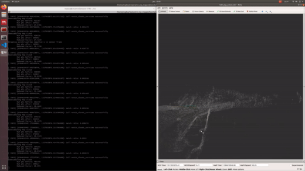

# ICP Mapper

This a ROS package for calculating vehicle odometry and pointcloud register using Interative Closest Point (ICP). The package's core algorithm - ICP is implemented by the library [PointMatcher](https://github.com/ethz-asl/libpointmatcher). My development focuses on integrating this library into an unified ROS network and tested it with [raw data](http://www.cvlibs.net/datasets/kitti/raw_data.php) of KITTI dataset

## Installation

1. Prerequisite: *ROS Melodic*

1. Install `libpointmatcher` by following the library's [guide](https://libpointmatcher.readthedocs.io/en/latest/Compilation/).

1. Get `libpointmatcher_ros` at [this link](https://github.com/ethz-asl/ethzasl_icp_mapping/tree/reintegrate/master_into_indigo_devel/libpointmatcher_ros) in the same catkin workspace of this package and put it into `src` folder of your carkin workspace

1. Clone this project

```
$ cd your_catkin_workspace/src
$ git clone https://github.com/quan-dao/rev_icp_mapper
$ cd .. && catkin build
```

## Getting Started

The launch files in `launch` folder test the algorithm against KITTI sequences. Therefore, you should have the _bag file_ of these sequences first. If you have KITTI data downloaded on your hard disk, you can use the Python library `kitti2bag` ([link](https://github.com/tomas789/kitti2bag)) to convert it into _bag files_ which can later be played by `rosbag`. Or, you can download one from [here](https://drive.google.com/open?id=1ndx5k5YE33edJwcSuIhb7QBD6XMlS6UX).

Once you have the bag file, change the absolute path to the file in *line 11* of `./launch/corrected_clouds.launch`.

Now, let's light it up

```
$ roslaunch rev_icp_mapper corrected_clouds.launch
```

If everything is functional, you can visualize the odometry and the pointcloud registration using `RViz`. 


